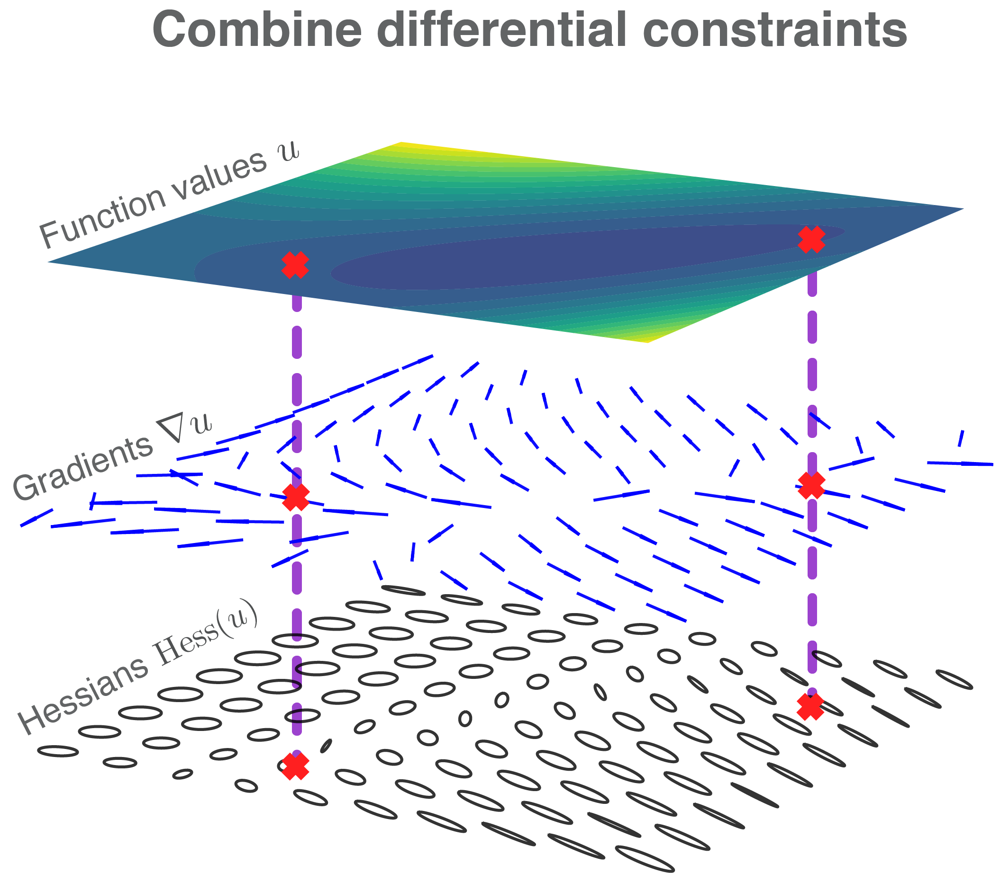
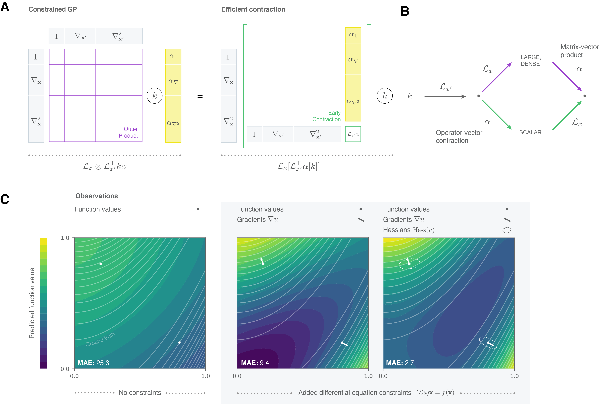

# ad-kernels
Supplementary material for **"Algorithmic Differentiation for Automatized Modelling of Machine Learned Force Fields"** by Niklas Frederik Schmitz, Klaus-Robert Müller and Stefan Chmiela.

The preprint is available here: https://arxiv.org/abs/2208.12104

<div align="middle">

</div>



## Content

1. [md17/](md17/)
    - [gdml_jax](md17/gdml_jax/)    
      - a small toolbox focused on gradients and molecular force fields
    - [train_sgdml.py](md17/experiments/train_sgdml.py)
      - code for fitting different models to MD17 forces
    - [experiments/schnetkernel](md17/experiments/schnetkernel/)
      - utils for schnetpack interop
    - [hyper_coulomb.py](md17/experiments/hyper_coulomb.py)
      - example on efficiently optimizing kernel hyperparameters by another outer level of AD
    - [benchmark_forces.py](md17/experiments/md17_benchmark_forces.py)
      - benchmark for dense instantiation vs fast operator kernel contraction
2. [pde/](pde/) more general differential operators (gradients, Hessians, VJP, ...)
   - [opgp_demo.ipynb](pde/opgp_demo.ipynb) 
     - A 2D regession problem using gradients and Hessians
   - [laplace.ipynb](pde/laplace.ipynb) 
     - A toy example solving Laplace's equation on an annulus
   - [wave_eq.ipynb](pde/wave_eq.ipynb)
     - A toy example solving a wave equation in one dimension


## Requirements

- python 3.8
- [JAX](https://github.com/google/jax#installation)

Below is an example setup:

```
conda create -n ad-kernels python=3.8
conda activate ad-kernels
cd md17 && pip install -e .
```

## Citation

```
@misc{https://doi.org/10.48550/arxiv.2208.12104,
  author = {Schmitz, Niklas Frederik and Müller, Klaus-Robert and Chmiela, Stefan},
  title = {Algorithmic Differentiation for Automatized Modelling of Machine Learned Force Fields},
  publisher = {arXiv},
  year = {2022},
  doi = {10.48550/ARXIV.2208.12104},
  url = {https://arxiv.org/abs/2208.12104},
  copyright = {arXiv.org perpetual, non-exclusive license}
}

```
